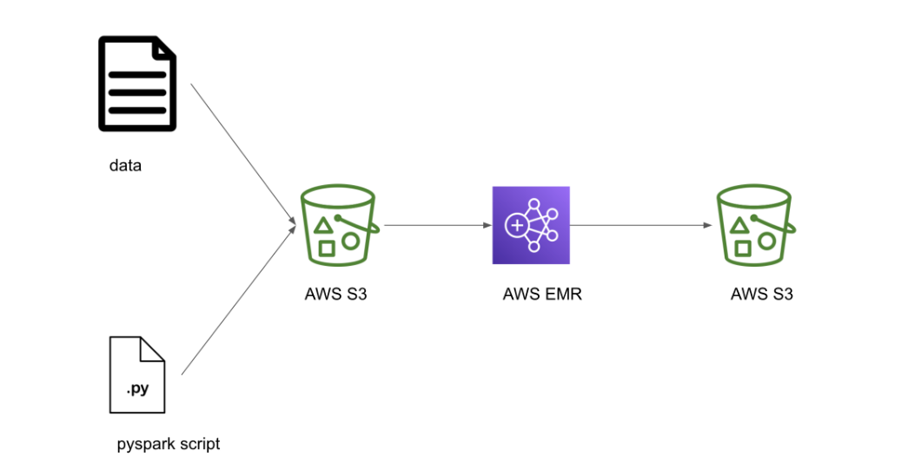

**AWS EMR Cluster and Apache Spark Job Submission with Airflow**

**Overview**

This guide explains the process of creating an AWS EMR cluster, submitting Apache Spark jobs using Airflow with Boto3, waiting for job completion, and terminating the EMR cluster.

**Prerequisites**

- An AWS account with the necessary permissions.
- Apache Airflow installed and configured.
- The Boto3 library installed in your Airflow environment.

### Architecture Diagram

**Airflow DAG**

**Steps**

**1. Create an AWS EMR Cluster**

Use Boto3 to create an EMR cluster within your Airflow DAG. Specify the cluster name, release label, applications (like Spark), instance configurations, and logging details.

**2. Submit Apache Spark Jobs to the Cluster**

After creating the cluster, use Boto3 to submit your Apache Spark job. You’ll define the job parameters, including the location of the Spark script in S3.

**3. Wait for Job Completion**

Utilize Airflow’s built-in sensors to monitor the job status. This will ensure that the workflow waits until the Spark job has completed successfully.

**4. Terminate the AWS EMR Cluster**

Once the job is finished, use Boto3 to terminate the EMR cluster to avoid incurring additional costs.

**Notes**

- Update the S3 paths and EMR configurations as needed.
- Monitor the cluster's performance and logs through the AWS Management Console.
- Ensure that the Spark job script is correctly uploaded to the specified S3 location.

**Conclusion**

By following these steps, you can automate the creation, management, and termination of an AWS EMR cluster while efficiently submitting and monitoring Apache Spark jobs using Airflow and Boto3.

